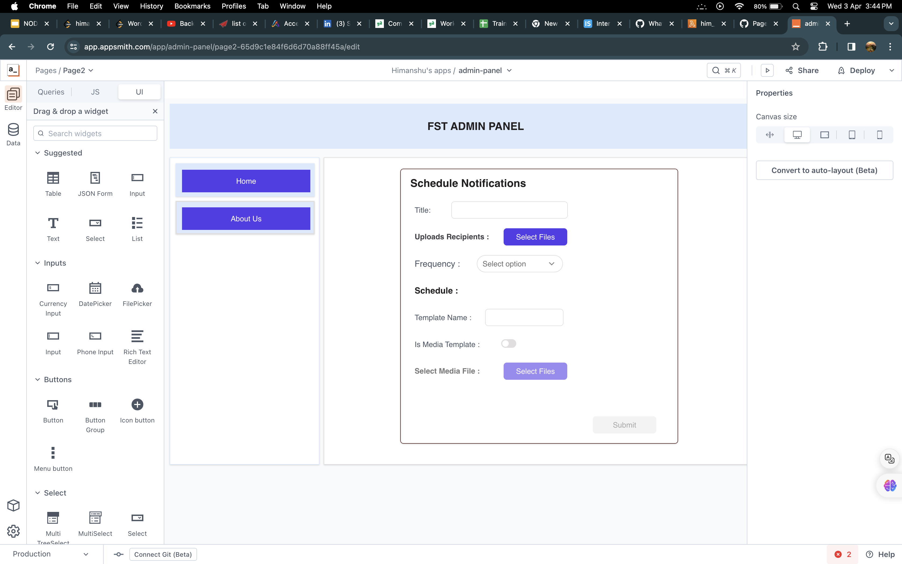

# FDX Admin Panel

## Overview

The FDX Admin Panel is a tool designed to streamline the process of scheduling WhatsApp reminders for specific target audiences. This eliminates the need for manual message sending, making the process more efficient and less error-prone. With this panel, users can schedule one-time or recurring reminders easily from a centralized dashboard.

## Functionality

### Admin Panel

#### Schedule Notifications

1. **Navigation**: Users can access the Schedule Notifications page by clicking on the "Notifications" option in the side navigation bar on the home page. Other navigation options include "About Us" and "Home".

2. **Form**: The Schedule Notifications page contains a form where users can input details about the notification to be sent.

    - **Title**: Text representing the notification being scheduled (e.g., GFG POTD reminder, FSTEDx session reminder).
    
    - **Upload Recipient**: Option to upload a CSV file containing recipient mobile numbers. Only one CSV file is supported, and it must have a single column titled "mobile". 
    
    - **Frequency**: Dropdown menu to select whether the reminders should be sent once (one-time) or in a series (daily) from a start date to an end date, inclusive of both dates. Selecting a value from this dropdown activates the "Schedule" field.
    
    - **Schedule Modal**: Depending on the selected frequency, a modal opens to capture schedule details. Mandatory fields include:
        - One-time frequency: Date and time
        - Daily frequency: Start date, end date, and fixed time
        
    - **Template Name**: Field to input the template name (template will be shared separately).
    
    - **Is Media Template**: Switch to mark whether the template is a text or media template. The switch is disabled by default, indicating a text template. If set to a media template, a file picker becomes visible.
    
    - **File Picker**: Visible only when the template is marked as a media template. Allows users to upload media files.
    
3. **Form Submission**: Users can submit the form if all data is input correctly. Otherwise, an error pop-up/alert will appear.

### User's Landing Page

### Schedule Notifications Page

### Conditional Modals at Schedule Notifications Page

### Functionality | Notifications |Final OutPut

